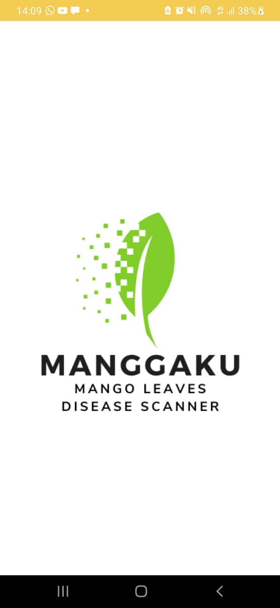

<!-- Improved compatibility of back to top link -->
<a id="readme-top"></a>

<!-- PROJECT SHIELDS -->
<!-- Add any shields relevant to your project here -->

<!-- PROJECT LOGO -->
<br />
<div align="center">
  <a href="https://github.com/nurvibrgtyn/ManggakuApp">
    
  </a>

  <h3 align="center">Manggaku</h3>

  <p align="center">
    An app to detect diseases on your mango leaves using machine learning.
  </p>
</div>

<!-- ABOUT THE PROJECT -->
## About The Project

<div align="center">
<a href="https://github.com/nurvibrgtyn/ManggakuApp">
    
  </a>
  <a href="https://github.com/nurvibrgtyn/ManggakuApp">
    
  </a>
  <a href="https://github.com/nurvibrgtyn/ManggakuApp">
    
  </a>
</div>

Manggaku leverages machine learning to identify diseases affecting mango leaves. The app is designed to assist farmers and agricultural enthusiasts in managing plant health effectively.

Here's why this project is valuable:
* It helps in early disease detection, reducing crop loss.
* Empowers users with knowledge about mango leaf diseases.
* Aims to enhance productivity and sustainability in mango farming.

<p align="right">(<a href="#readme-top">back to top</a>)</p>

### Built With

This section lists major frameworks/libraries used in your project.

* TensorFlow
* Kotlin
* Android SDK
* OpenCV

<p align="right">(<a href="#readme-top">back to top</a>)</p>

<!-- GETTING STARTED -->
## Getting Started

Follow these steps to set up the project locally.

### Prerequisites

* Android Studio
* Kotlin
* TensorFlow Lite

### Installation

1. Clone the repo
   ```sh
   git clone https://github.com/nurvibrgtyn/ManggakuApp.git
   ```
2. Open the project in Android Studio.
3. Sync your project with Gradle files.
4. Ensure you have all required dependencies installed.

<p align="right">(<a href="#readme-top">back to top</a>)</p>

<!-- CONTRIBUTING -->
Contributing
Contributions are what make the open-source community a great place to learn, inspire, and create. Any contributions you make are greatly appreciated.

If you have a suggestion that would make this better, please fork the repo and create a pull request. You can also open an issue with the tag "enhancement".

Top contributors:
<a href="https://github.com/nurvibrgtyn/ManggakuApp/graphs/contributors">  </a> <p align="right">(<a href="#readme-top">back to top</a>)</p>

<!-- LICENSE -->
License
Distributed under the MIT License. See LICENSE.txt for more information.

<p align="right">(<a href="#readme-top">back to top</a>)</p>

<!-- CONTACT -->
Contact
Nurvi Brigityana - brigityana.nurvi@gmail.com

Project Link: https://github.com/nurvibrgtyn/ManggakuApp

<p align="right">(<a href="#readme-top">back to top</a>)</p>

<!-- MARKDOWN LINKS & IMAGES -->
